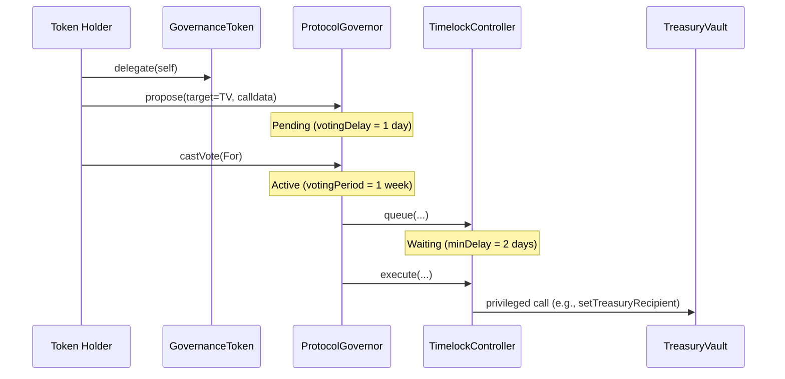

# Governance Architecture

## Components
- `GovernanceToken` (`ERC20Votes + ERC20Permit`) provides delegated voting power snapshots.
- `ProtocolGovernor` manages proposal lifecycle (`propose -> vote -> queue -> execute`).
- `TimelockController` enforces a 2-day execution delay.
- `TreasuryVault` (`ERC4626`) is treasury-owned by role assignment to the timelock.

## Parameterization (Spec-Aligned)
- Voting delay: `1 day`
- Voting period: `1 week`
- Quorum: `4%`
- Proposal threshold: `1%` (configured at deployment)
- Timelock delay: `2 days`

## Execution Flow

## Access-Control Topology

## Contract Responsibilities
- `GovernanceToken`:
  - Delegation checkpoints are timestamp-based (`ERC-6372 mode=timestamp`).
  - `MINTER_ROLE` and `BURNER_ROLE` are explicit privileged surfaces.
- `ProtocolGovernor`:
  - Enforces governance configuration and timelock binding.
  - No direct treasury control without successful voting + timelock delay.
- `TreasuryVault`:
  - Role-gated admin functions (`setDepositCap`, `setTreasuryRecipient`, `rescueToken`).
  - Pausable deposits/mints; bounded by `depositCap`.
- `RentalVault`:
  - Role-gated settlement (`LISTING_MANAGER_ROLE`) for rental lifecycle finalization.
